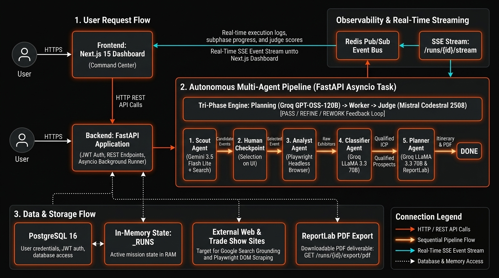

# System & Multi-Agent Architecture — ORBIT

ORBIT is an autonomous multi-agent system designed for preparing and optimizing commercial prospecting missions at B2B trade shows and industrial expos.

---

## 1. Pipeline Overview



The lifecycle of a mission follows an **Orchestrator-Worker** pattern with an enforced human-in-the-loop checkpoint:

```text
[User Input] (Sector, Region, Target ICP Profile)
        │
        ▼
   ┌─────────┐
   │  SCOUT  │  Web discovery of candidate trade shows
   └────┬────┘
        │
        ▼
┌──────────────────────┐
│  AWAITING_SELECTION  │  Human checkpoint: Target event selection
└───────┬──────────────┘
        │
        ▼
  ┌───────────┐
  │  ANALYST  │  Playwright JS rendering + Exhibitor extraction (Static / LLM)
  └─────┬─────┘
        │
        ▼
┌──────────────┐
│  CLASSIFIER  │  ICP qualification (Client / Partner / Competitor / Irrelevant)
└───────┬──────┘
        │
        ▼
   ┌─────────┐
   │ PLANNER │  Optimized visiting schedule, routing & sales talking points
   └────┬────┘
        │
        ▼
     [DONE]    Comprehensive report + Downloadable PDF export
```

---

## 2. Tri-Phase Engine per Stage (Planning ➔ Working ➔ Judging)

Every autonomous stage of the pipeline (excluding the human checkpoint) is broken down into **3 sequential subphases** supervised by specialized LLMs:

```text
┌────────────────────────────────────────────────────────┐
│                      STAGE N                           │
│                                                        │
│  1. PLANNING (Groq — GPT-OSS-120B)                     │
│     Generates customized prompt and success criteria.  │
│                       │                                │
│                       ▼                                │
│  2. WORKING (Specialized Worker Agent)                 │
│     Executes task (Gemini 3.5 Flash Lite / Groq)       │
│                       │                                │
│                       ▼                                │
│  3. JUDGING (Mistral — Codestral 2508)                 │
│     Evaluates output against stage success criteria.   │
│                       │                                │
│         ┌─────────────┼─────────────┐                  │
│         ▼             ▼             ▼                  │
│       PASS          REFINE        REWORK               │
│    (Stage N+1)    (Re-plan)    (Stage N-1)             │
└────────────────────────────────────────────────────────┘
```

### LLM Providers & Core Responsibilities:
- **Groq (`openai/gpt-oss-120b`)**: **Planning & Orchestration Engine** dynamically generating the `prompt_worker` and `success_criteria` based on runtime context.
- **Google Gemini (`gemini-3.5-flash-lite`)**: **Web Discovery & Extraction Engine** powering the Scout (with Google Search Grounding and resilient fallbacks) and Analyst fallback.
- **Groq (`llama-3.3-70b-versatile`)**: **High-Throughput Inference Engine** for high-speed batch classification (Classifier) and schedule optimization (Planner).
- **Mistral (`codestral-2508`)**: **Independent Reference Judge**, evaluating output compliance with near-deterministic low temperature (`0.1`) for reproducible verdicts.

---

## 3. State Machine & Feedback Loop (Judge Verdicts)

The Mistral Judge analyzes the worker output and renders one of 3 strict verdicts:

1. **`PASS`**:
   - The success criteria are fully met.
   - The orchestrator advances cleanly to the next pipeline stage.
2. **`REFINE`** (Local Prompt Refinement):
   - The output is promising but incomplete or partially compliant (e.g. descriptions too brief, minor formatting issues).
   - The Planning engine refines the worker prompt incorporating the Judge's concrete suggestions and triggers a re-run.
   - **Infinite Loop Safeguard**: After 2 attempts (`MAX_RETRIES = 2`), a **`forced_pass`** is triggered with the `low_confidence = True` flag.
3. **`REWORK`** (Step Rollback):
   - The output is fatally flawed due to upstream data issues (e.g. the selected trade show has no accessible exhibitors).
   - The pipeline rolls back to the preceding stage (`ANALYST` ➔ `SCOUT`).
   - Capped at 1 rollback attempt per stage to ensure bounded execution time.

---

## 4. Real-Time Streaming (SSE) & Pause/Resume via Redis

The backend provides a real-time event stream (Server-Sent Events) consumed directly by the Next.js Command Dashboard:

- **Redis Pub/Sub**: Each mission owns its private channel: `run:{run_id}:events`.
- **Broadcast Events**:
  - `stage_started`, `stage_completed`
  - `subphase_started`, `subphase_completed`
  - `judge_verdict` (verdict, score, reasoning, suggestions)
  - `rework`, `forced_pass`
  - `run_paused`, `run_done`
- **Asynchronous Control (Pause / Resume)**:
  The API sets a `run:{run_id}:pause_requested` flag in Redis. The orchestrator checks this key before entering each subphase, pausing gracefully without corrupting or dropping state.

---

## 5. Data & Memory Architecture

ORBIT implements a hybrid tiered memory model:

| Layer | Technology | Data Stored | Persistence |
|---|---|---|---|
| **Relational Database** | PostgreSQL 16 (SQLAlchemy + Alembic) | Users, salted bcrypt password hashes, JWT identities | Permanent on disk |
| **Server Memory** | Python `_RUNS` Dictionary (FastAPI) | Full mission execution states (`RunState`) | Volatile (process lifecycle) |
| **Event Broker** | Redis 7 | Pub/Sub SSE channels & pause/resume control flags | In-Memory |
| **Client Frontend** | React State + `localStorage` | JWT session tokens, active mission ID, UI filters | Browser / Client session |
